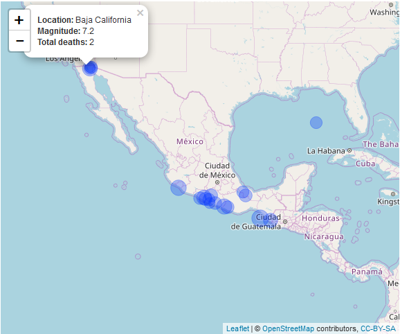

[](https://travis-ci.org/arthurgailes/RCapstone)

<!-- README.md is generated from README.Rmd. Please edit that file -->

```{r, echo = FALSE}
knitr::opts_chunk$set(
  collapse = TRUE,
  comment = "#>",
  fig.path = "README-",
  echo = TRUE
)
```

# The Coursera/Johns Hopkins Mastering Software Development in R Capstone Project

The Coursera/Johns Hopkins Mastering Software Development in R Capstone Project examines earthquake data from  the U.S. National Oceanographic and Atmospheric Administation's (NOAA) dataset of significant earthquakes. For more info, visit: [click here](https://www.ngdc.noaa.gov/nndc/struts/form?t=101650&s=1&d=1).

## Installation

You can install RCapstone from github with:

```{r gh-installation, eval=F}
# install.packages("devtools")
devtools::install_github("arthurgailes/RCapstone")
```

```{r data_variable, eval = T, include=F, echo = F}
devtools::install_github("arthurgailes/RCapstone")
NOAA <- RCapstone::NOAA
```


## Read and clean data

This function loads and formats the earthquake data used for the graphs

```{r clean_data, eval=F}
data <- RCapstone::eq_clean_data(RCapstone::NOAA)
```

## Earthquakes in US and China after 2000

This graphs earthquakes in US and China after 2000; the radius of the circles charts the richter-scale magnitude of the earthquakes.

```{r graph_timeline, eval=T, fig.width=6, fig.height=3}
RCapstone::geom_timeline(RCapstone::NOAA)
```

## Labeled earthquakes in US and China after 2000

This graphs earthquakes in US and China after 2000; the radius of the circles
charts the richter-scale magnitude of the earthquakes. The largest earthquakes are labeled.

```{r graph_timeline_labeled, eval=T, fig.width=6, fig.height=5}
RCapstone::geom_timeline_label(RCapstone::NOAA)
```

## Map of earthquakes in Mexico

Generates a Map of earthquakes in Mexico after 2000. The radius of the circles corresponds to the magnitude of the earthquakes.

```{r Mexico_map, eval=F, fig.width=6, fig.height=5}
RCapstone::eq_map(data = RCapstone::NOAA)
#the interactive version cannot be displayed on Github
```


```{r, out.width = "600px", eval = T, echo = F}

```