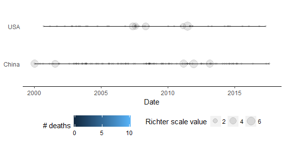
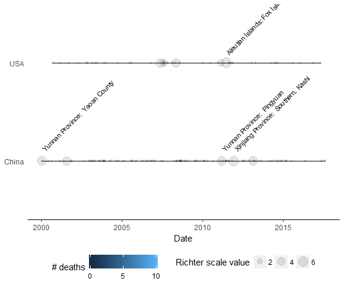

[](https://travis-ci.org/arthurgailes/RCapstone)

<!-- README.md is generated from README.Rmd. Please edit that file -->
The Coursera/Johns Hopkins Mastering Software Development in R Capstone Project
===============================================================================

The Coursera/Johns Hopkins Mastering Software Development in R Capstone Project examines earthquake data from the U.S. National Oceanographic and Atmospheric Administation's (NOAA) dataset of significant earthquakes for more info, visit: [click here](https://www.ngdc.noaa.gov/nndc/struts/form?t=101650&s=1&d=1).

Installation
------------

You can install RCapstone from github with:

``` r
# install.packages("devtools")
devtools::install_github("arthurgailes/RCapstone")
```

Read and clean data
-------------------

This function loads and formats the earthquake data used for the graphs

``` r
data <- RCapstone::eq_clean_data(RCapstone::NOAA)
```

Earthquakes in US and China after 2000
--------------------------------------

This graphs earthquakes in US and China after 2000; the radius of the circles charts the richter-scale magnitude of the earthquakes.

``` r
RCapstone::geom_timeline(RCapstone::NOAA)
```



Labeled arthquakes in US and China after 2000
---------------------------------------------

This graphs earthquakes in US and China after 2000; the radius of the circles charts the richter-scale magnitude of the earthquakes. The largest earthquakes are labeled.

``` r
RCapstone::geom_timeline_label(RCapstone::NOAA)
```



Map of earthquakes in Mexico
----------------------------

Generates a Map of earthquakes in Mexico after 2000. The radius of the circles corresponds to the magnitude of the earthquakes.

``` r
RCapstone::eq_map(data = RCapstone::NOAA)
#the interactive version cannot be displayed on Github
```


